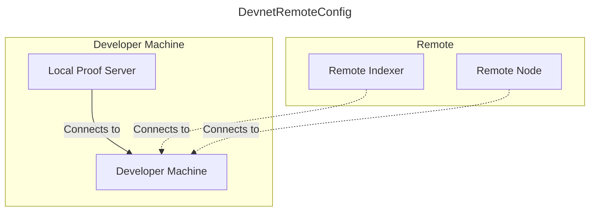
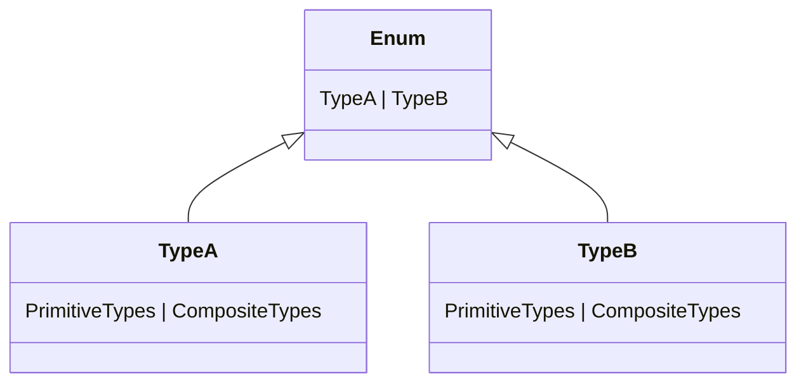
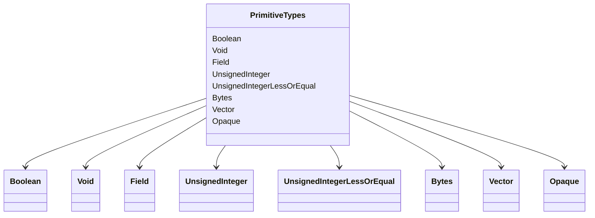
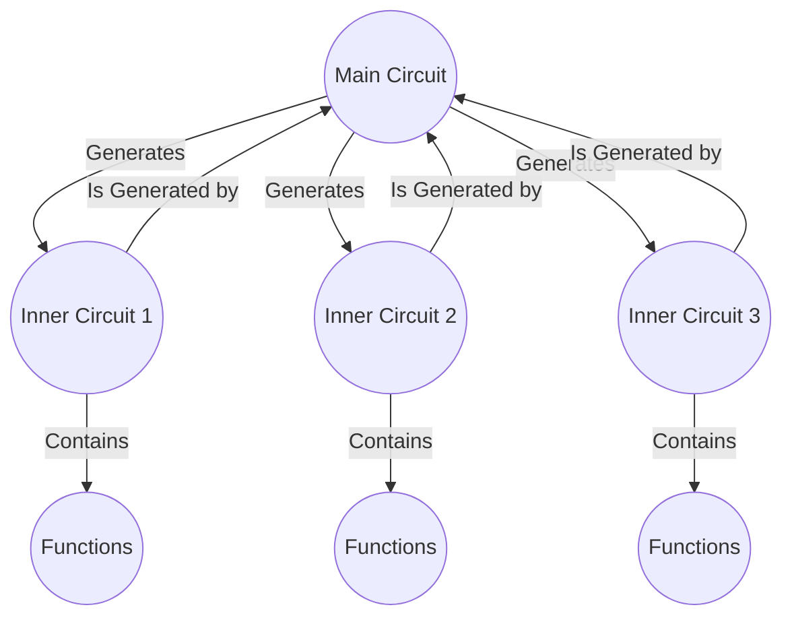
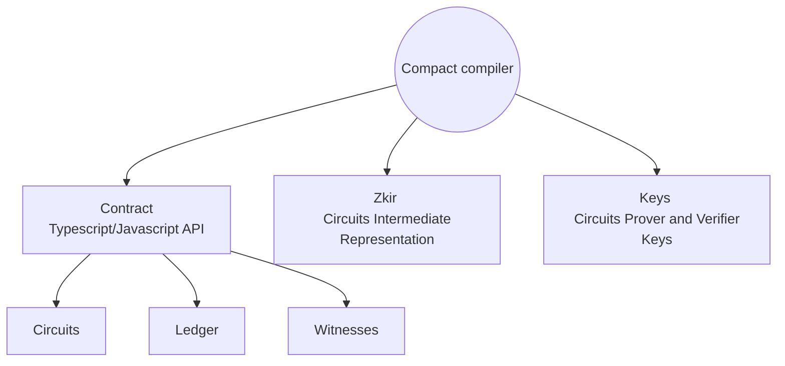
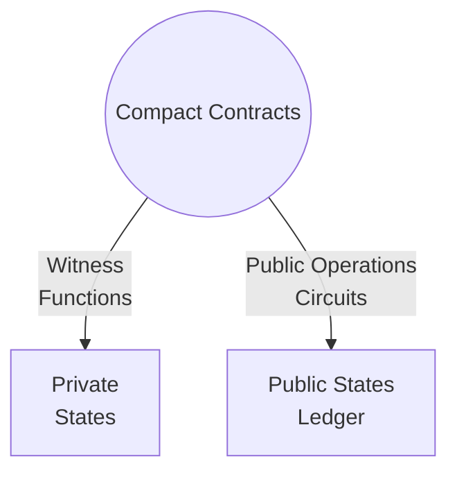

```mermaid
---
title: DevnetRemoteConfig
---
graph TD

  subgraph Developer Machine
    A[Local Proof Server] -->|Connects to| B[Developer Machine]
  end

  subgraph Remote
    C[Remote Indexer] -.->|Connects to| B
    D[Remote Node] -.->|Connects to| B
  end
```

```mermaid
classDiagram
  class Enum {
    TypeA | TypeB
  }

  class TypeA {
    PrimitiveTypes | CompositeTypes
  }

  class TypeB {
    PrimitiveTypes | CompositeTypes
  }

  Enum <|-- TypeA
  Enum <|-- TypeB
```

```mermaid
classDiagram
  class Primitive Types {
    Boolean
    Void
    Field
    UnsignedInteger
    UnsignedIntegerLessOrEqual
    Bytes
    Vector
    Opaque
  }

  Primitive Types --> Boolean
  Primitive Types --> Void
  Primitive Types --> Field
  Primitive Types --> UnsignedInteger
  Primitive Types --> UnsignedIntegerLessOrEqual
  Primitive Types --> Bytes
  Primitive Types --> Vector
  Primitive Types --> Opaque
```

```mermaid
graph TD
  A((Main Circuit)) -->|Generates| B((Inner Circuit 1))
  A -->|Generates| C((Inner Circuit 2))
  A -->|Generates| D((Inner Circuit 3))
  B -->|Is Generated by| A
  C -->|Is Generated by| A
  D -->|Is Generated by| A
  B -->|Contains| E((Functions))
  C -->|Contains| F((Functions))
  D -->|Contains| G((Functions))
```

```mermaid
flowchart
  direction LR
  A((Compact compiler)) --> B1[Contract \n Typescript/Javascript API]
  B1 --> C1[Circuits]
  B1 --> C2[Ledger]
  B1 --> C3[Witnesses]
  A --> B2[Zkir \n Circuits Intermediate Representation]
  A --> B3[Keys \n Circuits Prover and Verifier Keys]
```

```mermaid
flowchart TB
    A((Compact Contracts))
    A -->|Witness \n Functions| B[Private \n States]
    A -->|Public Operations \n Circuits| C[Public States \n Ledger]
```
