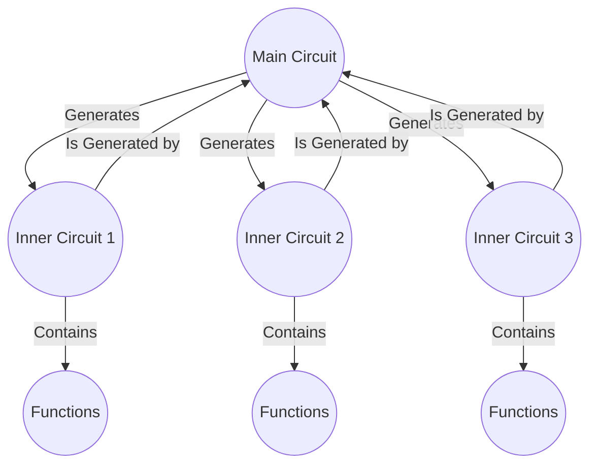
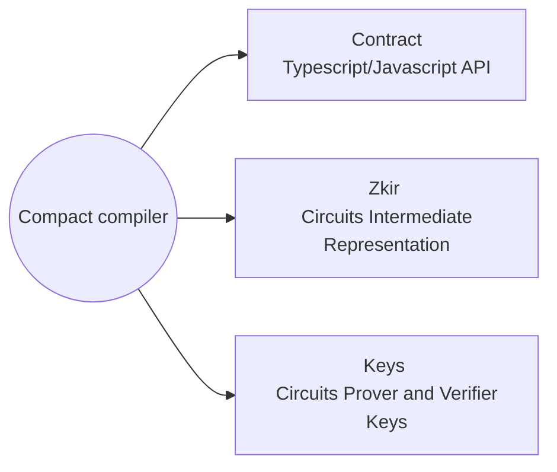
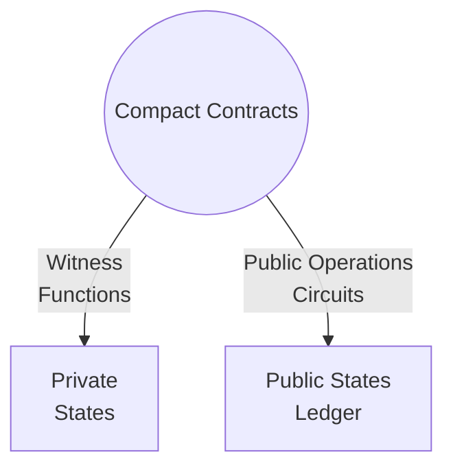

```mermaid
graph TD
  A((Main Circuit)) -->|Generates| B((Inner Circuit 1))
  A -->|Generates| C((Inner Circuit 2))
  A -->|Generates| D((Inner Circuit 3))
  B -->|Is Generated by| A
  C -->|Is Generated by| A
  D -->|Is Generated by| A
  B -->|Contains| E((Functions))
  C -->|Contains| F((Functions))
  D -->|Contains| G((Functions))
```

```mermaid
flowchart LR
    A((Compact compiler))
    A --> B1[Contract \n Typescript/Javascript API]
    A --> B2[Zkir \n Circuits Intermediate Representation]
    A --> B3[Keys \n Circuits Prover and Verifier Keys]
```

```mermaid
flowchart TB
    A((Compact Contracts))
    A -->|Witness \n Functions| B[Private \n States]
    A -->|Public Operations \n Circuits| C[Public States \n Ledger]
```
