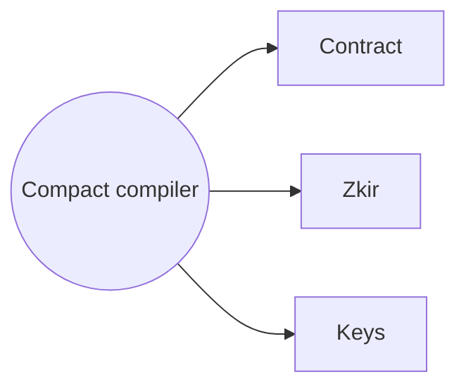
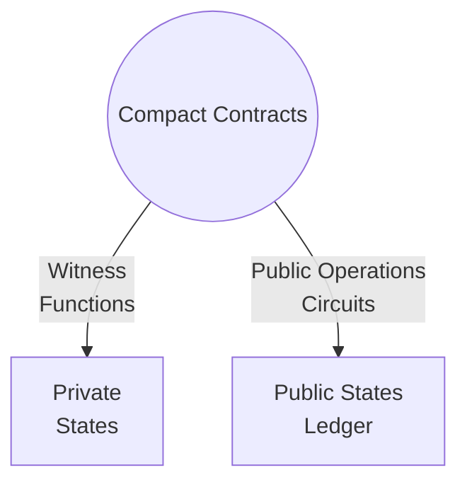

```mermaid
flowchart LR
    A((Compact compiler))
    A --> B1[Contract]
    A --> B2[Zkir]
    A --> B3[Keys]
```

```mermaid
flowchart TB
    A((Compact Contracts))
    A -->|Witness \n Functions| B[Private \n States]
    A -->|Public Operations \n Circuits| C[Public States \n Ledger]
```
